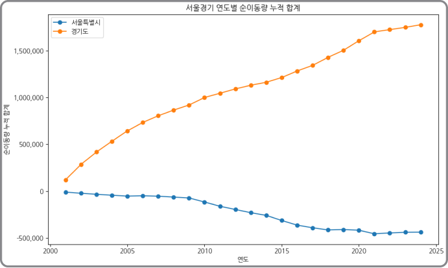
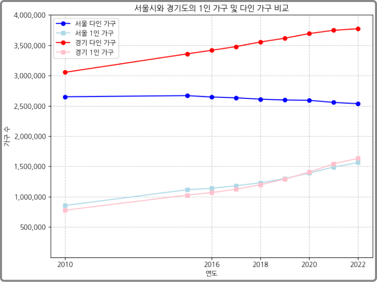
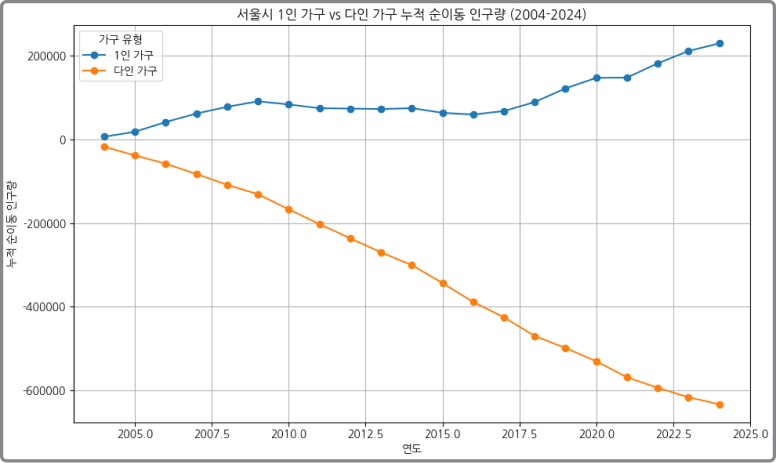
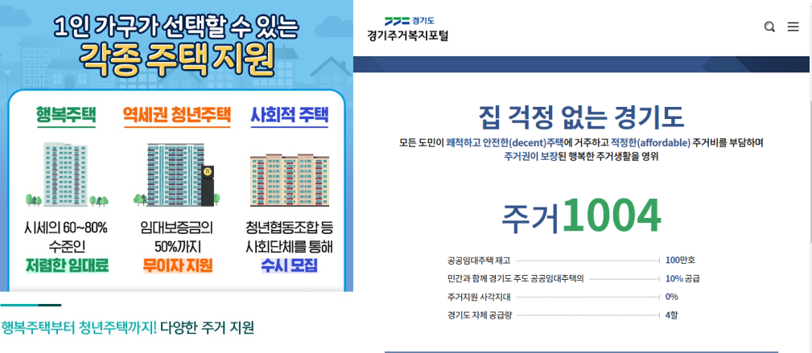
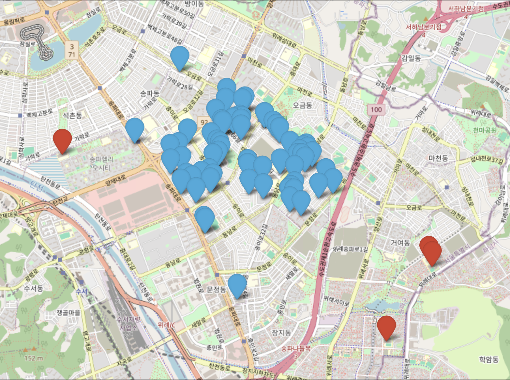

# 수도권 부동산 정상화를 위한 정책 탐색
EDA 프로젝트 3조 영끌방지대책위원회

***
## 01 프로젝트 소개
> 수도권 인구 변동과 인프라에 대한 정보와 부동산 통계정보 수집을 통해 수도권 부동산 시장 현 상태의 원인 분석 및 안정화를 위한 방안 제시

  수도권 아파트 매매가가 지방권보다 급격하게 상승하고 있는 상황, 10년간의 물가 변동과 비교해보아도 수도권 아파트의 연 평균 매매가의 상승치가 훨씬 심각하다.
 
 

  최근 한국은행이 이러한 문제의 대책으로 "주요 대학 지역할당제"를 제안했다. 우리조는 이러한 공공기관이나 정부가 추진하는 부동산 정책들이 효과가 있을지 알아보고자 거시경제요인을 제외한 인프라들을 인구, 교육, 교통, 의료 분야로 나누어 자료를 수집하고 분석 및 시각화를 하였다.

  
***
## 02 프로젝트 멤버
* 팀장 : 김소영 (DB설계, 교통의료분야 자료조사, 분석 및 시각화)
* 팀원 : 김선웅 (교육분야 자료조사, 분석 및 시각화)
  &nbsp;&nbsp;&nbsp;&nbsp;&nbsp;김종호 (발표, 인구분야 자료조사, 분석 및 시각화)
  &nbsp;&nbsp;&nbsp;&nbsp;&nbsp;윤희태 (부동산분야 자료조사, 분석 및 시각화)
 

|역할|이름|담당|
|-:|:-|:-|
|팀장|김소영|DB설계, 교통의료분야 자료조사, 분석 및 시각화|
|팀원|김선웅|교육분야 자료조사, 분석 및 시각화|
|&nbsp;|김종호|발표, 인구분야 자료조사, 분석 및 시각화|
|&nbsp;|윤희태|부동산분야 자료조사, 분석 및 시각화|

   

***
## 03 프로젝트 기술

|분류|기술|
|-|-|
||  |
|DB| |
|협업||
   

***
## 04 데이터 수집

 
### 04-1. 부동산 분야
* **(크롤링) 아파트 매매 수급 동향 2014-2024, 월별 아파트 평균 매매가 2014-2024** : [한국부동산원 R-ONE](https://www.reb.or.kr/r-one/portal/stat/easyStatPage.do)
  * 수도권 및 지방권 월별 아파트 매매에 대한 수급 지수
  * 수도권 및 지방권 월별 아파트 매매가에 대한 평균값
* **(크롤링) 서울시 동별 연도별 아파트 평균 매매가 2014-2024, 가락동 아파트별 매매가 2014-2024** : [서울시 부동산 정보 광장](https://land.seoul.go.kr:444/land/rtms/rtmsApartment.do)
  * 서울시 모든 동의 연도별 아파트 매매가에 대한 평균값
  * 서울시 송파구 가락동에서 10년 동안 매매된 모든 아파트들에 대한 매매가
* **(표) 연도별 대한민국 물가 상승률 2014-2024** : [KOSIS](https://kosis.kr/statisticsList/statisticsListIndex.do?vwcd=MT_ZTITLE&menuId=M_01_01)
  * 아파트 가격 상승률과 비교하기 위한 물가 상승률
   

### 04-2. 인구 분야
* 시군구별 이동건수 : [KOSIS](https://kosis.kr/statHtml/statHtml.do?orgId=101&tblId=DT_1B26007&vw_cd=MT_ZTITLE)
  * 가구 크기별 시도간 전입 수
* 시군구 전입 사유별 이동 건수 : [KOSIS](https://kosis.kr/statHtml/statHtml.do?orgId=101&tblId=DT_1B26B21&vw_cd=MT_ZTITLE)
  * 전입 사유별 시도간 전입 수
* 서울시 동단위 이동 건수 : [서울시 열린 데이터 광장](https://kosis.kr/statHtml/statHtml.do?orgId=101&tblId=DT_1B26B21&vw_cd=MT_ZTITLE)
  * 동단위 서울시 인구 이동 통계

  
### 04-3. 교육 분야
* 서울시 사업체현황 : [서울시 열린데이터 광장](https://data.seoul.go.kr/dataList/104/S/2/datasetView.do)
  * 지역별 사교육 업체 수
 
  
### 04-4. 교통/의료 분야
* 교통접근성지표 2016-2021 : [국도교통DB](https://www.ktdb.go.kr/www/selectTrnsportTreeView.do?key=32)
  * 교육시설, 의료시설, 판매시설, 광역교통시설(버스터미널, 철도역, 공항)에 대한 접근성  
  

***
## 05 데이터 분석

### 05-1. 부동산 분야

  * 지방권과 비교했을 때, 수도권의 아파트 매매 평균 매매 가격이 더 비싼건 기본이고, 상승폭도 더 큰 것을 확인할 수 있다.
  * 여기서 **수도권의 아파트 가격이 약간은 비정상적으로 가파르게 상승한다는 가설 및 문제점을 파악**해볼 수 있다.
 

  * 수도권의 아파트 평균 매매가 상승률과 대한민국 물가 상승률을 비교해보니 **물가에 비해 수도권 아파트 평균 매매가 그래프가 더 가파르게 변화한다.**
  * 이는 **수도권 아파트 가격의 상승폭 및 변화량이 비정상적이라는 이전의 가설 및 문제점을 뒷받침**한다.
 

### 05-2. 인구 분야
* 
  * 수도권 인구 총량은 증가하는 것을 확인했다.
  * 경기도로 들어오는 순이동 인구 수가 서울시에서 나가는 순인구수보다 압도적으로 많다.
  * 이는 경기도 집 수요 증대를 초래했다
 

* 
  * 단순 인구 수가 아닌, 가구 수는 어떨까? 
  * 1인 가구 수가 증가함으로서 주택 가격에 영향을 미쳤을 수도 있겠다. 
 

* 
  * 서울시 순이동 그래프를 보면 더 확실하다.
  * 다인 가구는 오히려 전출을 통해 나가고 있지만, 1인 가구는 계속해서 유입되고 있다.
 

* 
  * 따라서 이런 공공 임대 주택 정책이나 행복주택, 청년 주택, 사회적 주택등의 정책은 유효해 보인다.
 

* 
  * 하지만, 주택 공급을 지원하는 것이 아닌 1인가구 독려 정책은 안 그래도 높은 1인가구의 수요를 더 높일 수 있다.
 

### 05-3. 교육 분야
*그래프
  * ~설명~
  * 
### 05-4. 교통/의료 분야
*그래프
  * ~설명~

### 05-5. 가락1동 분석

#### 05-5-1 가락1동
*그래프
  * ~설명~
#### 05-5-2 가락1동 교육 분야
*그래프

  * ~설명~
#### 05-5-3 가락1동 의료 분야
*그래프
  * ~설명~

***
## 06 결론

